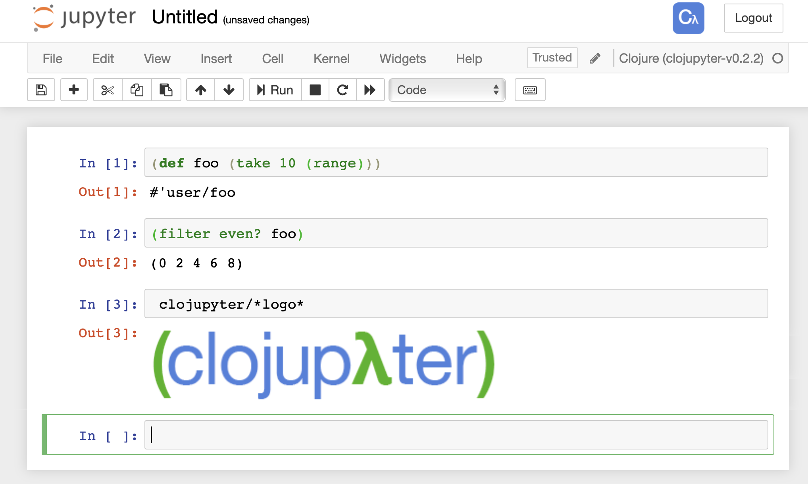

A Jupyter kernel for Clojure - run Clojure code from Jupyter Lab, Notebook and Console.

[](https://travis-ci.org/clojupyter/clojupyter)

## Table of Contents

* [Getting Started](#getting-started)
* [Installation](#installation)
* [The Docker Way](#the-docker-way)
* [To do](#todo)
* [Collaboration](#collaboration)

##



## Getting Started

In the `examples` folder of the repository there 3 example notebooks showing some of the features
of clojupyter.  See
[this notebook](https://github.com/clojupyter/clojupyter/blob/master/examples/demo-clojupyter.ipynb)
showing examples of how you can display HTML and use external Javascript:


There are 3 example notebooks because Jupyter offers several distinct
user interfaces - Jupyter Lab, Jupyter Notebook and Jupyter Console -
which have different feature sets for which clojupyter offers
different support. We have one example notebook showing the features
shared by Lab and Notebook and for each showing their distinct
features. According to the Jupyter development roadmaps, Jupyter
Notebook will eventually be phased out and completely replaced by
Jupyter Lab.

You can also use existing JVM charting libraries since you can render any Java BufferedImage.


## Installation

1. `git clone https://github.com/clojupyter/clojupyter`
2. `cd clojupyter`
3. `make`
4. `make install`

This will install a clojupyter kernel and a configuration file to tell
Jupyter how to use clojupyter in from jupyter's user kernel location (in
`~/.local/share/jupyter/kernels` on linux and `~/Library/Jupyter/kernels`
on Mac).

## Running Jupyter with clojupyter


#### Jupyter Notebook

To start Jupyter Notebook do:

```bash
jupyter notebook
```

and choose 'New' in the top right corner and select 'Clojure (clojupyter...)' kernel.

#### Jupyter Lab

To start Jupyter Lab do:

```bash
jupyter lab
```

#### Jupyter Console

You can also start the Jupyter Console by doing:

```bash
jupyter-console --kernel=clojupyter
```

## The Docker way

A Docker image  exists to make trying out clojupyter easier.  To try it:

1. [Install Docker](https://docs.docker.com/engine/installation/) based on your platform.
2. Run `docker run -p 8888:8888 --rm simplect/clojupyter:0.2.2` to have clojupyter
   run on your machine.

The first time you start it Docker will pull the Docker image from `hub.docker.com`, which takes time.

More detailed introduction and usage guide is available on
[the home page of the clojupyter Docker image](https://github.com/klausharbo/clojupyter-docker).

## TODO

Development progress is based on voluntary efforts so we can't make any promises, but the near-term
road map for clojupyter development looks something like this:

### v0.2.3 (tentative)
* [ ] Packaging: Support `conda install` on Mac
  * [ ] Create basic conda-build artifact
  * [ ] Add ability install in Anaconda cloud
  * [ ] Setup proof-of-concept conda install
* [ ] Reach: Support `conda install` on Linux
* [ ] Reach: Support `conda install` on Windows

### v0.2.4 (tentative)
* [ ] Support reindentation (clj-fmt?)
  * [ ] Create proof-of-concept
  * [ ] Figure out how to install/uninstall feature easily
* [ ] Clarify/simplify external access to rendering
* [ ] Simplify Oz interface to clojupyter (eliminate dependency from Oz to clojupyter)
  * [ ] Create Oz PR to eliminate dependency
  * [ ] When accepted: Eliminate clojupyter.protocol.mime-convertible

### v0.2.5 (tentative)
* [ ] Accept input from user
* [ ] Refactor clojupyter.nrepl.nrepl-comm
* [ ] Connect to running Clojure instance using nREPL
* [ ] Improve middleware implementation (async, pluggable)

Feed-back on development priorities is welcome, use the issue list for input and suggestions.

## Collaboration
If you submit a pull request that ends up getting merged, we will give you commit access.
